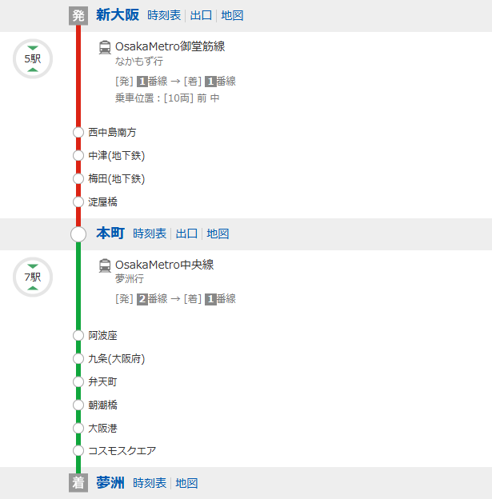
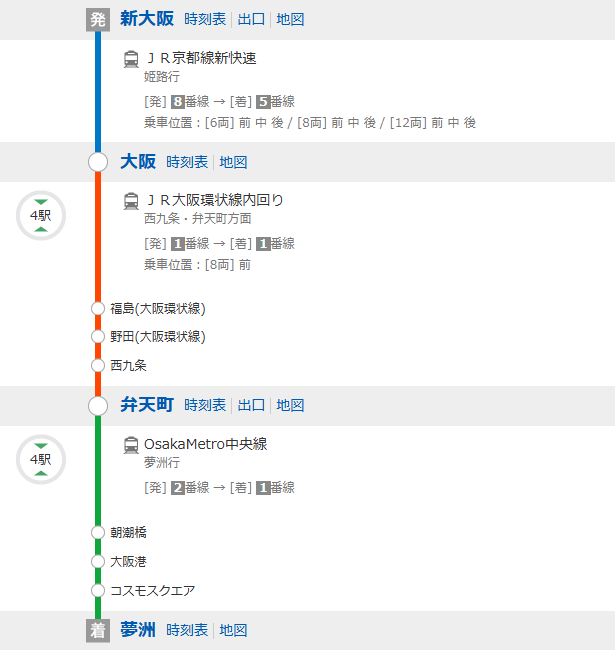
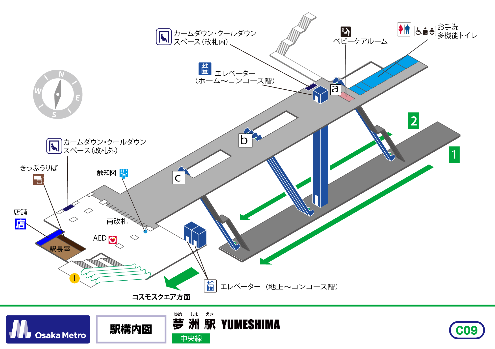
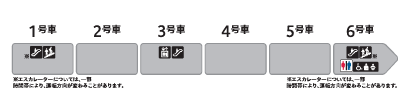

# 万博会場まで

## 会場へのアクセス手段

| 交通手段   | メリット                                             | デメリット                             |
| ---------- | ---------------------------------------------------- | -------------------------------------- |
| 地下鉄     | 運行頻度が非常に高い 新大阪からフリーパスが使える | ピークの時間だとあまりにも人が多すぎる |
| JR バス | 新大阪駅から直通の電車も出ている                     | (恐らく)地下鉄よりは運行頻度が低い     |
| 自動車     | -                                                    | そもそも万博へ自家用車では行けない     |

> [!NOTE]
>
> ### **地下鉄の運行頻度について**
>
> 現在、万博会場まで直通している大阪メトロ中央線は、万博用臨時ダイヤで運行しています。 
> 元々の運行頻度から大増発してとんでもない量の列車を運行しています。 
> なので、地下鉄利用では待ち時間はほぼ発生しません。
>
> | 万博開催前         | 万博開催後     |
> | ------------------ | -------------- |
> | 最大毎時 10 本程度 | 最大毎時 24 本 |
>
> ※これを東京で例えると、武蔵野線が山手線レベルの運行頻度になったような状態

## 鉄道利用の場合のルート

大阪メトロのみ (推奨)

JR線＋大阪メトロ

## 夢洲駅の構造

- 駅構内図 
  

- 乗降位置 
  

> [!TIP]
>
> ### おすすめのエスカレーター
>
> 駅構内図にて `b` と記されているエスカレーターがオススメです。 
> エスカレーターが 3 台あり大量に人を運ぶことができるので **比較的** 混みにくいです。

> [!TIP]
>
> ### おすすめの乗車位置
>
> 3 号車に乗ることをオススメします。 
> 先述の `b` エスカレーターが一番近いのは 3 号車だからです。

---

[トップページへ戻る](../main.md)
