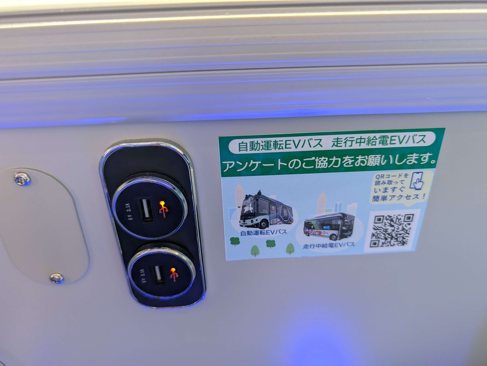

# 持ち物

私が実際に持っていったものに加えて、持っていけばよかったと思った物を書いてきます。

水筒

> ### 重要度：★★★
>
> ## 備考
>
> - ペットボトルでも可
> - 無料の給水コーナーが複数箇所にあるので、とにかく水分をいれることができる容器があれば OK
> - 自販機の相場は 150 円以上
> - 会場内で買うなら東ゲート付近のローソンが最安値

帽子

> ### 重要度：★★★
>
> ## 備考
>
> - 影が少ない関係で日光を浴びる時間が長くなる
> - **風が強め**なので飛んでいかないように気をつける
> - 実際目の前で数人帽子が風で飛んでいたし本人は気づいてなかったという場面を見かけました。(拾って渡したよ)

モバイルバッテリー

> ### 重要度：★★★
>
> ## 備考
>
> - 勿論会場内で充電できる場所は基本的に無い
> - 1 人あたりモバイルバッテリー 2 台分くらい持っておくといいかも
> - 一応、自動運転バスには USB Type-A の充電用端子があったが、20 分程度の乗車な上に乗車には料金が発生する
>
> ## 参考画像
>
> - 自動運転バスに各席にあった USB 充電ポート
>   

扇風機・うちわ・扇子等

> ### 重要度：★★★
>
> ## 備考
>
> - 会場内に入るとそれなりに風が吹いているので歩いている分には熱くて仕方ない程ではない
> - 入場前や各パビリオンへの順番待ちの際は動いていないし風が来ないので非常に暑く感じる
>   バッテリー式の扇風機を持っていったが、電池残量を気にしなくていい扇子やうちわ等も持っておくと安心

決済手段

> ### 重要度：★★★
>
> ## 備考
>
> - 会場内は電子決済のみ
> - クレジットカードとモバイル Suica があれば基本全部の場所で支払える
>
> ## 参考画像
>
> そもそも自販機に現金をいれる機構が物理的に潰されている
> 

薄手の上着

> ### 重要度：★★☆
>
> ## 備考
>
> - それなりに風が強いので夜になると寒いらしい (職員さん談)

食料

> ### 重要度：★★☆
>
> ## 備考
>
> - 1 袋で複数個入っているタイプのパンとか
> - ちょっとお腹が空いたからと色々買っていたら 1 つ 1 つが高いので最終的にとんでもない金額を使うことになる

折りたたみの傘

> ### 重要度：★☆☆
>
> ## 備考
>
> - そもそも風が強いので傘が飛んでいきそうになる
> - 実際何人も傘が飛びかけている人がいた
> - 大阪市港区の風で実際自分の傘が壊れたことがある
> - 上記の理由から順番待ちしている時に日傘代わりする程度が望ましい

